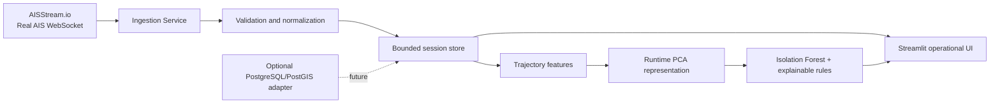
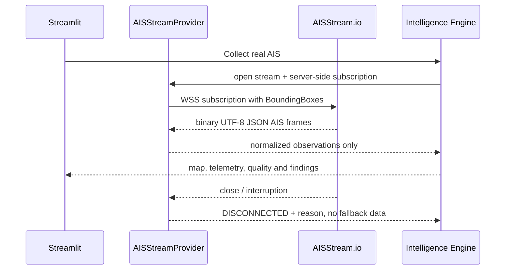

# Maritime Intelligence Engine (MIE)

Plataforma de inteligência marítima para ingestão, validação, análise de trajetórias, visualização geoespacial e detecção explicável de anomalias comportamentais em dados **AIS reais**.

> **Regra de integridade:** o MIE não implementa AIS sintético, embarcações simuladas, trajetórias falsas, fallback datasets ou resultados fabricados. Sem conexão válida com o AISStream, a aplicação apresenta um estado operacional vazio e informa `REAL AIS DATA UNAVAILABLE`.

## Visão geral

O sistema usa o [AISStream.io](https://aisstream.io/documentation) como provedor de dados em tempo real. A conexão é feita exclusivamente no servidor por WebSocket, e a chave é lida de uma variável de ambiente local ou de `st.secrets` no Streamlit Community Cloud. Conexões diretas do navegador ao AISStream não são usadas, de modo que a credencial nunca é exposta ao frontend [1].

A interface foi desenhada como um posto operacional escuro e compacto, com o mapa como elemento principal. O estado de dados é sempre explícito: `LIVE AIS` quando mensagens reais estão sendo recebidas, `CONNECTING` durante a abertura/assinatura do WebSocket e `DISCONNECTED` quando não há disponibilidade. Dados de sessão não são reclassificados como históricos.

## Arquitetura



O frontend Streamlit atua somente como camada de apresentação e orquestração da sessão. O contrato `AISProvider` permite a substituição futura por outro provedor real, sem criar um provedor sintético.

| Camada | Implementação atual | Garantia de integridade |
| --- | --- | --- |
| Ingestão | `AISStreamProvider` com `websocket-client` | Decodifica frames binários UTF-8 e aceita somente mensagens `PositionReport` válidas |
| Processamento | `processing.quality` e `trajectory.features` | Valida MMSI, coordenadas, velocidade, curso, duplicidades, gaps e saltos impossíveis |
| Armazenamento | `ObservationStore` em memória por sessão | Limite de mensagens; nenhum dado é inventado ou persistido como live sem origem real |
| Representação | Vetor de características + `StandardScaler` + PCA | Ajustado somente sobre tracks reais recebidos nesta sessão |
| Anomalias | `IsolationForest` e regras explicáveis | Sinaliza anomalias comportamentais; nunca infere intenção hostil |
| Interface | Streamlit + Plotly + PyDeck | Estados de conexão e indisponibilidade transparentes |

## Fluxo de dados



A assinatura deve incluir uma caixa geográfica e ser enviada logo após a abertura da conexão. O AISStream documenta limite de três conexões por conta e por IP, necessidade de leitura contínua e reconexão com backoff; o cliente deste projeto usa uma janela finita por ação do operador e reconexão exponencial com jitter [1]. Após cada coleta, o Overview exibe a duração efetiva, mensagens reais recebidas, vessels distintos, tracks com pelo menos dois pontos, status dos embeddings e quantidade de anomalias. Behavior, Similarity e ML Anomaly permanecem condicionados a pelo menos três tracks com histórico suficiente; o sistema não reduz esses requisitos para preencher a interface.

## Estrutura do projeto

```text
maritime-intelligence-engine/
├── app.py
├── src/
│   ├── analytics/traffic.py
│   ├── anomaly/detector.py
│   ├── config/settings.py
│   ├── geospatial/map_data.py
│   ├── ingestion/aisstream.py
│   ├── ingestion/models.py
│   ├── intelligence/engine.py
│   ├── ml/embeddings.py
│   ├── processing/quality.py
│   ├── storage/memory.py
│   ├── trajectory/features.py
│   └── ui/
│       ├── pages.py
│       ├── presentation.py
│       └── temporal.py
├── tests/test_core.py
├── .streamlit/config.toml
├── .env.example
├── Dockerfile
├── docker-compose.yml
├── packages.txt
├── requirements.txt
└── README.md
```

As áreas de trabalho disponíveis são Overview, Vessels, Vessel Intelligence, Trajectory Analysis, Behavior, Anomalies, Traffic, Data Quality e System. A navegação é feita no mesmo shell operacional, evitando a aparência de páginas Streamlit desconectadas.

## Inteligência e limitações do modelo

Não há um checkpoint público pré-treinado de trajetória incluído ou alegado neste repositório. O sistema informa explicitamente `none: runtime PCA/IsolationForest trained only on real AIS observations`. A representação é construída a partir de latitude, longitude, SOG, COG, heading change, delta temporal, distância percorrida e velocidade calculada; depois, o PCA e o detector são ajustados somente quando há observações reais suficientes.

### Semântica temporal

O modelo canônico mantém `received_at` como um `datetime` timezone-aware em UTC: é o instante em que o MIE recebe ou processa o frame. `ais_timestamp_second` preserva somente o segundo UTC informado pelo `PositionReport.Timestamp`; valores normais são 0–59 e os estados especiais 60–63 são mantidos como estados AIS, nunca convertidos em uma data/hora completa. `observed_at` permanece `None` porque o envelope atualmente utilizado não fornece uma fonte absoluta comprovada do instante em que o navio gerou o relatório. `MetaData.time_utc` também não é promovido para observation time sem evidência semântica suficiente.

Freshness, ordenação, trajetórias e agrupamentos de Traffic usam `received_at` e são rotulados como tempo de recebimento. A UI usa `Last received`, `Received`, `AIS UTC second` e `Observation time: UNAVAILABLE` para evitar confusão. Latency permanece `UNAVAILABLE`: o MIE não interpreta a diferença modular entre o relógio do servidor e o segundo AIS como latência de rede.

O armazenamento permanece em UTC. Conversões para horário regional ou do operador ocorrem apenas na apresentação com `zoneinfo`. Miami usa `America/New_York`, Santos usa `America/Sao_Paulo`, Singapore usa `Asia/Singapore` e Rotterdam usa `Europe/Amsterdam`. English Channel usa UTC por abranger múltiplos contextos locais; Custom também usa UTC por padrão. O operador pode selecionar UTC, `America/Sao_Paulo`, `America/New_York`, `Europe/London`, `Europe/Amsterdam` ou `Asia/Singapore`, sem alterar o timestamp armazenado.

A detecção combina limiares explicáveis para velocidade, gaps, mudanças bruscas de curso e permanência, com o score do Isolation Forest sobre a projeção. Esses scores são heurísticos e exploratórios, não uma validação científica ou uma classificação operacional de risco. O resultado deve ser interpretado como **behavioral anomaly detected**, não como ameaça, intenção ou atividade hostil. Sem histórico AIS real conectado, a busca de similaridade usa somente a sessão real atual e não é rotulada como histórica. O campo `Timestamp` do PositionReport é tratado como segundo dentro do minuto UTC; para frescor, ordenação e stale state, o sistema usa o instante de recepção do frame e preserva o segundo AIS separadamente.

## Configuração local

Instale Python 3.11 ou superior, crie um ambiente virtual e instale as dependências:

```bash
python -m venv .venv
source .venv/bin/activate
pip install -r requirements.txt
cp .env.example .env
```

Edite `.env` e preencha `AISSTREAM_API_KEY` com uma chave obtida na [conta oficial do AISStream](https://aisstream.io/account). Configure também `AIS_AREA_MIN_LAT`, `AIS_AREA_MIN_LON`, `AIS_AREA_MAX_LAT` e `AIS_AREA_MAX_LON`; os nomes são semânticos, portanto `min_lat < max_lat` e `min_lon < max_lon`, e a aplicação rejeita caixas invertidas, incompletas ou fora dos limites geográficos. A interface oferece janelas de coleta de 30, 60, 120 e 180 segundos, com 60 segundos como default; o valor selecionado é passado diretamente ao engine e ao WebSocket, dentro desse limite operacional. A sidebar também oferece presets de Bounding Box para Miami, Santos, Singapore, Rotterdam e English Channel, além de Custom. A alteração de região substitui o provider e o armazenamento da sessão anterior antes da próxima assinatura, evitando misturar regiões. A chave não deve ser colocada no código, no README, no frontend, em logs ou no Git.

Execute:

```bash
streamlit run app.py
```

Sem a chave, a aplicação ainda inicia para permitir auditoria visual e testar o estado seguro de indisponibilidade; ela não mostra embarcações ou métricas fabricadas.

## Streamlit Community Cloud

Publique o repositório e configure `app.py` como arquivo principal. Em **Settings → Secrets**, adicione a chave como TOML:

```toml
AISSTREAM_API_KEY = "sua-chave-fornecida-pelo-aisstream"
AIS_AREA_MIN_LAT = "25.603"
AIS_AREA_MIN_LON = "-80.208"
AIS_AREA_MAX_LAT = "25.835"
AIS_AREA_MAX_LON = "-79.879"
```

Os secrets são opcionais para o boot, mas são necessários para que o deploy receba AIS real. A alteração da caixa na interface é aplicada à próxima assinatura WebSocket e produz a indicação `Region updated. Collect again to open a new subscription.`. A operação não deve ser declarada como bem-sucedida até que a aplicação publicada mostre `LIVE AIS`, contador de mensagens crescente e pelo menos uma atualização real recebida do AISStream. A documentação oficial também proíbe conexões diretas do navegador, por isso a chave é lida somente no processo Streamlit [1].

## Testes

A suíte cobre configuração sem credencial, parsing do envelope AISStream, descarte de mensagens que não são `PositionReport`, matemática de distância, guarda de trajetória insuficiente, qualidade vazia e inválida, ausência de anomalias sem observações e transparência sobre o não uso de checkpoint pré-treinado:

```bash
pytest -q
python -m compileall app.py src tests
```

Os testes não alimentam a aplicação com tráfego sintético. Dados AIS reais não são incluídos no repositório. Uma validação online com mensagens reais exige uma chave AISStream válida e uma caixa geográfica operacional. A suíte também verifica as quatro janelas de coleta, o encaminhamento do tempo selecionado, o readiness baseado em tracks reais, os presets geográficos e o tratamento explícito de SOG ausente.

## Segurança e privacidade

O `.gitignore` exclui `.env`, `st.secrets.toml`, bancos locais, caches de modelos e artefatos temporários. O repositório não contém credenciais. A aplicação não imprime a chave, não a envia ao browser e não registra o payload bruto no frontend.

## Roadmap técnico

A próxima evolução recomendada é adicionar um repositório PostgreSQL/PostGIS opcional com retenção e classificação explícita de `HISTORICAL AIS`. Em seguida, pode-se implementar um worker persistente separado para ingestão contínua, uma fila de mensagens com observabilidade e um índice vetorial para similaridade em tracks reais. A camada atual mantém a separação deliberada entre o estado live do provider e o `ObservationStore` da sessão; uma fonte de verdade única só deve ser adotada com testes de regressão específicos para seleção, clear session e atualização do mapa. Deep Learning permanece fora desta versão: quando houver histórico real suficiente, a V2 deverá comparar o baseline IsolationForest com um Autoencoder/VAE em janelas temporais com train/validation/test, sem dataset sintético ou checkpoint sem justificativa verificável.

## Referências

[1]: https://aisstream.io/documentation "AISStream — Developer Documentation"
